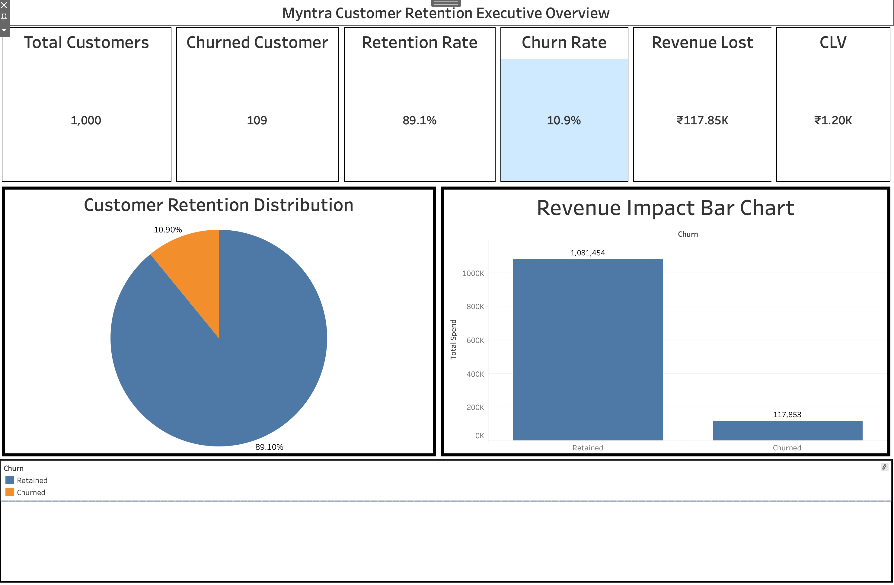
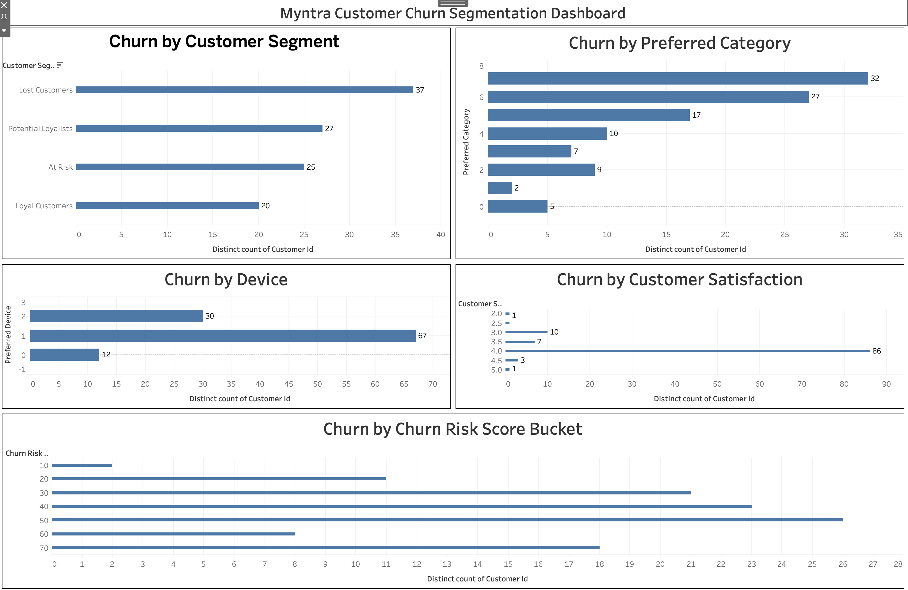
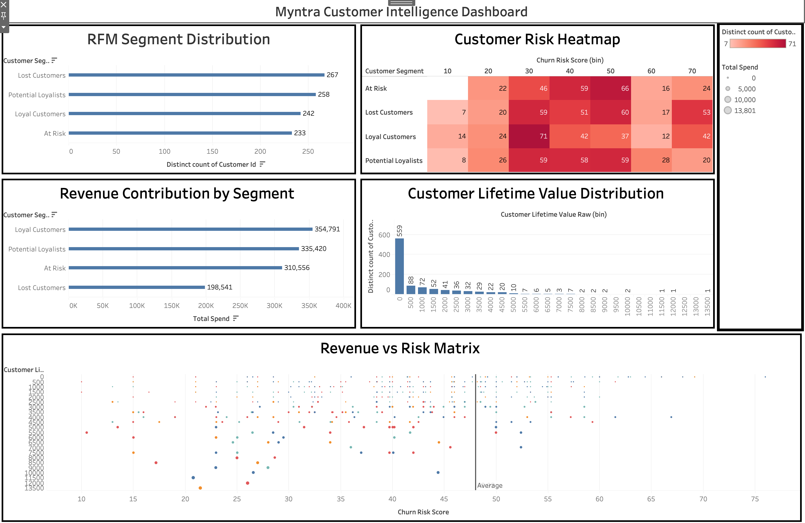
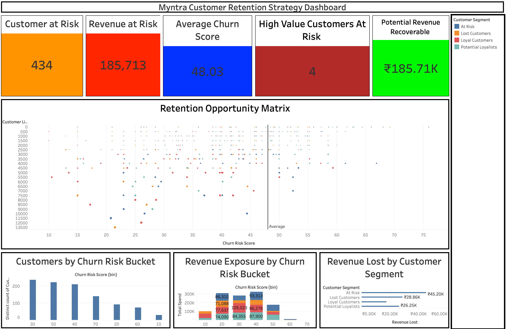

# Myntra Customer Retention & Churn Intelligence Platform
Predict customer churn using behavioral analytics and machine learning models to improve customer retention strategies.

- Python
- MySQL
- Pandas
- Scikit-Learn
- XGBoost
- Tableau
- GitHub

SQL Data Engineering
↓
Data Cleaning
↓
Exploratory Data Analysis
↓
Feature Engineering
↓
Machine Learning
↓
Explainability
↓
Business Intelligence Dashboard

- Logistic Regression
- Random Forest
- XGBoost

SQL Data Engineering
↓
Data Cleaning
↓
Exploratory Data Analysis
↓
Feature Engineering
↓
Machine Learning
↓
Explainability
↓
Business Intelligence Dashboard

- Logistic Regression
- Random Forest
- XGBoost

- Recency
- Frequency
- Monetary Value
- Purchase Velocity
- Discount Dependency Score
- Return Behavior Score
- RFM Segmentation

- Cart abandonment is the strongest churn indicator.
- Discount dependency increases churn probability.
- Low customer satisfaction strongly correlates with churn.
- Reduced order frequency increases churn risk.
# Myntra Customer Retention & Churn Intelligence Platform

## Overview
Predict customer churn using behavioral analytics and machine learning models to improve customer retention strategies for an e-commerce business.

---

## Tech Stack

- Python
- MySQL
- Pandas
- NumPy
- Scikit-Learn
- XGBoost
- Tableau
- GitHub

---

## Project Pipeline

```text
SQL Data Engineering
↓
Data Cleaning
↓
Exploratory Data Analysis
↓
Feature Engineering
↓
Machine Learning
↓
Model Explainability
↓
Business Intelligence Dashboard
```

---

## Machine Learning Models

- Logistic Regression
- Random Forest
- XGBoost

---

## Feature Engineering

Features created during feature engineering:

- Recency
- Frequency
- Monetary Value
- Purchase Velocity
- Discount Dependency Score
- Return Behavior Score
- RFM Segmentation
- Churn Risk Score

---

## Business Insights

- Cart abandonment is the strongest churn indicator.
- Discount dependency increases churn probability.
- Low customer satisfaction strongly correlates with churn.
- Reduced order frequency increases churn risk.
- High inactivity periods are associated with higher customer churn.

---

## Repository Structure

```text
Myntra-Customer-Retention-Churn-Platform/
│
├── datasets/
├── notebooks/
├── sql/
├── models/
├── images/
├── tableau/
├── requirements.txt
├── README.md
└── .gitignore
```

---

## Author

Ravikiran Singh Khangura
# Myntra Customer Retention & Churn Intelligence Platform

An end-to-end customer analytics and churn prediction platform built using SQL, Python, Machine Learning, and Tableau to identify churn drivers, quantify revenue risk, and design retention strategies for an e-commerce business.

---

## Project Objectives

- Predict customer churn using machine learning models.
- Identify behavioral and transactional churn drivers.
- Segment customers using RFM analysis.
- Quantify revenue exposure from churn.
- Build executive dashboards for retention strategy.

---

## Tech Stack

- Python
- MySQL
- Pandas
- NumPy
- Scikit-Learn
- XGBoost
- Tableau
- GitHub

---

## End-to-End Analytics Pipeline

```text
SQL Data Engineering
↓
Data Cleaning
↓
Exploratory Data Analysis
↓
Feature Engineering
↓
Machine Learning
↓
Model Explainability
↓
Business Intelligence Dashboards
```

---

## Machine Learning Models

- Logistic Regression
- Random Forest Classifier
- XGBoost Classifier

Evaluation Metrics:

- Accuracy
- Precision
- Recall
- F1 Score
- ROC-AUC

---

## Feature Engineering

Created Features:

- Recency
- Frequency
- Monetary Value
- Purchase Velocity
- Discount Dependency Score
- Return Behavior Score
- Churn Risk Score
- High Risk Customer Flag
- RFM Segmentation

---

## Explainability

Feature importance analysis was performed to identify key churn drivers.

Major churn drivers:

- Long inactivity period
- High return behavior
- Low purchase frequency
- Excessive discount dependency
- Low customer satisfaction

---

## Tableau Dashboards

### 1. Myntra Customer Executive Overview Dashboard

KPIs:

- Total Customers
- Churned Customers
- Retention Rate
- Revenue Lost
- Customer Lifetime Value

### 2. Myntra Customer Churn Segmentation Dashboard

Visualizations:

- Churn by Customer Segment
- Churn by Preferred Category
- Churn by Device
- Churn by Customer Satisfaction
- Churn Risk Distribution

### 3. Myntra Customer Intelligence Dashboard

Visualizations:

- RFM Segment Distribution
- Customer Risk Heatmap
- Revenue Contribution by Segment
- Customer Lifetime Value Distribution
- Revenue vs Risk Matrix

### 4. Myntra Customer Retention Strategy Dashboard

Visualizations:

- Customers at Risk KPI
- Revenue at Risk KPI
- Average Churn Score KPI
- High Value Customers at Risk KPI
- Potential Revenue Recoverable KPI
- Customers by Risk Bucket
- Revenue Exposure by Risk Bucket
- Revenue Lost by Customer Segment
- Retention Opportunity Matrix

---

## Dashboard Screenshots

### Dashboard 1 — Myntra Customer Executive Overview Dashboard



---

### Dashboard 2 — Myntra Customer Churn Segmentation Dashboard



---

### Dashboard 3 — Myntra Customer Intelligence Dashboard



---

### Dashboard 4 — Myntra Customer Retention Strategy Dashboard



---

## Repository Structure

```text
Myntra-Customer-Retention-Churn-Platform/
│
├── datasets/
├── notebooks/
├── sql/
├── tableau/
│   ├── dashboards/
│   └── Myntra_Customer_Retention_Intelligence.twbx
├── models/
├── images/
├── requirements.txt
├── README.md
└── .gitignore
```

---

## Business Impact

The platform enables businesses to:

- Identify customers likely to churn.
- Prioritize retention campaigns.
- Estimate revenue exposure.
- Optimize customer lifetime value.
- Improve retention ROI.

---

## Author

Ravikiran Singh # Myntra-Customer-Retention-Churn-Platform
